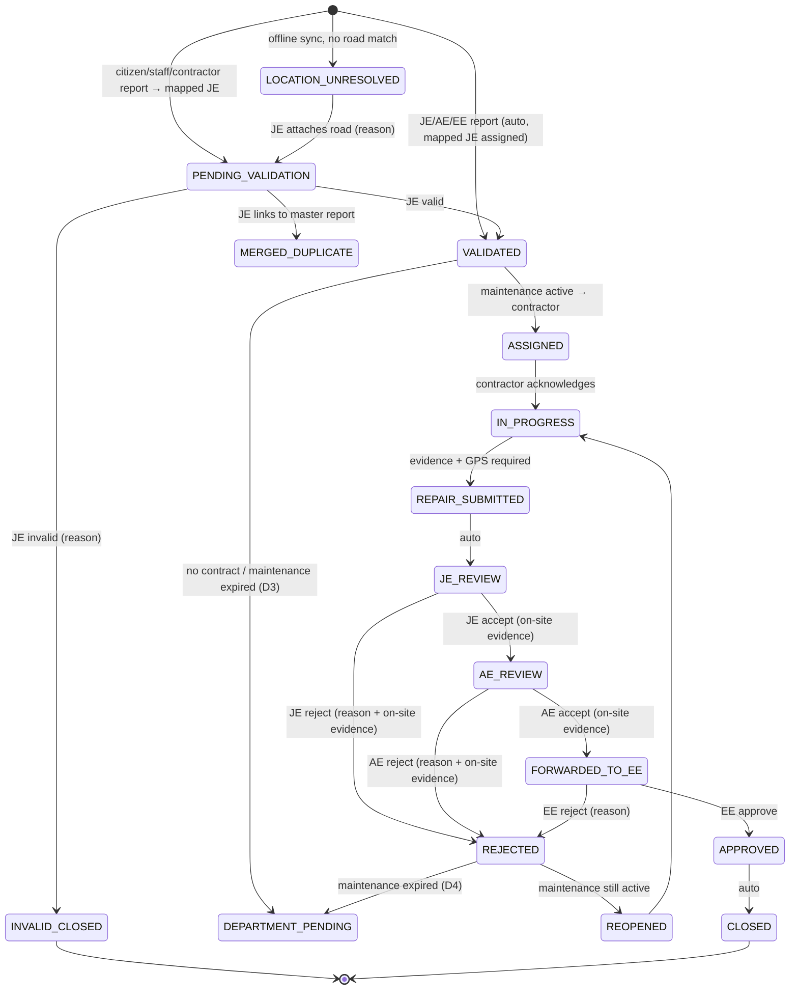
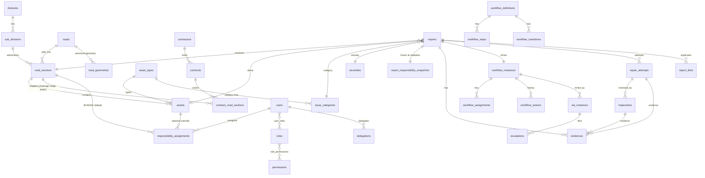

# RCD Road & Asset Monitoring System — Architecture & Implementation Plan

Status: **APPROVED 02-Oct-2026** with the decisions in §0
Date: 02-Oct-2026
Source: `requirement.md`

## 0. Approved decisions (02-Oct-2026)

| # | Decision |
|---|---|
| D1 | PHP: use Homebrew **PHP 8.4** (already installed, ≥ 8.3) for this project only, via `/opt/homebrew/opt/php/bin/php`. The global CLI stays on 8.2 so other local projects are unaffected. |
| D2 | Review is **sequential JE → AE → EE**. Each stage can accept (forward) or reject (reopen to contractor). When an AE or EE reports damage, the report is auto-validated and the **JE from the mapping** is assigned. |
| D3 | **No active contract, or maintenance period expired → department flow.** |
| D4 | **No responsibility snapshot carry-over.** If the maintenance period has ended when work is reopened, the report moves to the department flow. The department flow is **not yet specified**: v1 implements a placeholder `DEPARTMENT_PENDING` step assigned to the mapped JE (visible, SLA-free, audited), to be detailed later. |
| D5 | Citizen sign-up with **mobile number + OTP**. SMS goes through an `OtpSender` abstraction (log driver in dev). |
| D7 | **Mobile app on hold (02-Oct-2026).** Finish the web version first. Field reporting on the web uses the browser's Geolocation API and camera capture (`<input capture>`) on phones. The mobile JSON API (`/api/v1`) is deferred with the app; domain services stay UI-agnostic so the API is a thin layer later. |
| D8 | **SMS-OTP features parked (02-Oct-2026)**: no SMS provider yet. Citizen self-registration and forgot-password are behind setting `auth.sms_otp_enabled` (off; routes 404, links hidden). Admins create accounts and reset passwords. |
| D6 | Tables: **server-rendered Bootstrap tables** (Laravel paginator + vanilla-JS filter/sort via query string). No DataTables, so no jQuery. Other packages as in §9. |

---

## 1. Environment check

| Item | Required | Found | Action |
|---|---|---|---|
| PHP | 8.3+ | 8.2.28 global, **8.4.8 available** | Use 8.4 for this project (D1) |
| Composer | 2.x | 2.8.9 | OK |
| MySQL | 8+ | 8.4.6 | OK. Has SRID 4326 spatial types and spatial indexes. |
| Node/npm | for Vite build | 24 / 11 | OK |
| Flutter | for mobile | **missing** | Install Flutter SDK + Android SDK before Phase 11 |
| ffmpeg | video thumbnails/watermark | installed but **broken** (missing libx265) | `brew reinstall ffmpeg` before Phase 5 video processing |

Repository layout (monorepo):

```text
rcd/
  backend/        Laravel 12 (web + API)
  mobile/         Flutter app
  docs/           architecture, ERD, API, guides
  requirement.md
```

---

## 2. Contradictions and missing business rules

Each item has a **proposed default**. I will build on these defaults unless you change them.

| # | Issue | Proposed default |
|---|---|---|
| C1 | **Review stages are unclear.** §22 says "either JE OR AE reviews", but §23/§24 describe "rejected by JE" and "rejected by AE" as separate stages. | A **single review stage** that either the mapped JE or AE can claim (with a lock, so the first claim wins). A config flag `review_mode = single \| sequential` enables JE → AE → EE later. Either way, the rejecting role is recorded on each attempt. |
| C2 | **"Departmental action" isn't defined** for reports with no active maintenance contract (§20). | JE validates, then chooses one of: (a) **Departmental repair**: JE/AE records the work and evidence, followed by the same review and EE approval; (b) **Needs estimate/new work**: report is parked as `DEFERRED` with a reason, and the EE is notified. Both are workflow definitions, so they can be changed later. |
| C3 | **"Never trust client GPS" vs "GPS must come from the device"** (§13, §44). The server can't prove where a device was. | The server **re-resolves road, section, chainage and responsibility from the raw coordinates** and never accepts IDs from the client. It also runs plausibility checks: accuracy threshold, Android mock-location flag, GNSS fix time vs device time vs server receipt time, and photo EXIF vs declared GPS. Failures are flagged on the report, not silently accepted. |
| C4 | **Device clocks can't be trusted offline** for timestamps. | Store `captured_at_device`, `gps_fix_time` (from GNSS) and `received_at_server`. SLAs start at server receipt. The watermark shows GNSS time when available. |
| C5 | **Maintenance period expires mid-workflow.** What happens if the EE rejects after the contractor's maintenance end date? | Responsibility is **snapshotted when the report is validated**. Later rework stays with that contractor because the defect was reported in-period. |
| C6 | **"One contractor per section" vs chainage-range mapping.** `contract_road_sections` has its own start/end chainage, which allows partial sections. | Enforce **no overlapping chainage ranges on the same road for overlapping effective dates**. A full section is just the common case. Checked in a service + DB transaction, since MySQL has no exclusion constraints. |
| C7 | **The Asset entity has its own Contractor/JE/AE/EE fields** (§7), which duplicates section responsibility. | Assets **inherit** from their section by default. An optional asset-scoped row in `responsibility_assignments` overrides it (e.g., a bridge with its own contract). No duplicated columns. |
| C8 | **Seed data is marked as test data, but dashboards exclude test data by default** (§42, §60). The demo would show empty screens. | Exclusion stays the default everywhere. Outside `production`, demo users get `testdata.include` and a header toggle "Include Test Data" that persists per session. In `production`, test data never appears in official exports, toggle or not. |
| C9 | **Which reports skip JE validation?** Only citizen validation is specified. | Reports created by JE/AE/EE are auto-validated. Reports from citizens, RCD staff and contractors go to JE validation. Configurable per role. |
| C10 | **Off-network locations.** A citizen reports from a road that isn't an RCD road, or an offline report fails location validation at sync. | Online: blocked with the §14 message. Offline: the record is kept as `LOCATION_UNRESOLVED` (never deleted) and the reporter is notified. A JE can attach it to a road with a reason, which is audited. |
| C11 | **SLA clock.** Calendar hours or working hours? What counts as "contractor response"? | Calendar hours in v1, with a holiday-calendar hook. Response = contractor acknowledges the task (`IN_PROGRESS`). Repair = submission of the repair. Review/approval = time each stage is pending. |
| C12 | **Citizen onboarding** isn't specified. | Self-registration with mobile number + OTP behind an `OtpSender` abstraction (log driver in dev; SMS gateway TBD). |
| C13 | **Roads that cross divisions.** | Division and sub-division are stored on the **section**; the road keeps a "primary division". |
| C14 | **Financial year** | April–March. Timezone `Asia/Kolkata`. Chainage stored in metres (integer); displayed in km to 3 decimals. |
| C15 | **Video watermark** requires burning text into video, which is CPU-heavy. | Originals are always kept. A queued ffmpeg job produces the watermarked display copy and a thumbnail. If ffmpeg is missing, the player shows a metadata overlay instead, and this is logged. |
| C16 | **Map tiles.** The public OSM tile servers forbid heavy production use. | Dev uses OSM tiles. Production needs a self-hosted or commercial tile provider; the tile URL is a setting. |
| C17 | **DataTables requires jQuery.** | Accept jQuery only as a DataTables dependency, always server-side processing. All other JS is vanilla. |
| C18 | **Push notifications** need Firebase (FCM). | Firebase project/credentials needed from RCD. Until then, the `push` channel is a no-op driver. |
| C19 | **Table list (§45) review** | Merged `workflow_history` into `workflow_actions` (append-only log). `report_categories` becomes `issue_categories` keyed to `asset_types`. `road_geometries` is kept as a **versioned** table, so geometry edits never overwrite. See §4. |

---

## 3. Architecture

### 3.1 Backend layering

```text
app/
  Domain/                     business rules, no HTTP
    Gis/          GisEngine (interface), MysqlGisEngine, LinearReferencing, GeoJson
    Responsibility/ ResponsibilityResolver (GPS → road → section → chainage → contract → people)
    Reporting/    ReportService, DuplicateDetector, LocationValidator
    Evidence/     EvidenceService, WatermarkService, MediaProcessor (jobs)
    Workflow/     WorkflowEngine, Transition, Guards/*, Effects/*
    Delegation/   DelegationService, AssigneeResolver
    Sla/          SlaCalculator, EscalationService
    Performance/  ContractorMetrics (query objects returning metric + source IDs)
    Audit/        AuditLogger (append-only)
    Sync/         SyncService (idempotency)
  Http/
    Controllers/Web/*         Blade
    Controllers/Api/V1/*      JSON
    Requests/*  Resources/*  Middleware/(Permission, TestDataScope, ForceJson)
  Policies/*                  authorization via the manual RBAC
  Models/*                    Eloquent; traits: Auditable, HasTestFlag, HasUuid
  Jobs/* Notifications/* Console/Commands/*
```

- **Controllers are thin.** They validate (FormRequest), authorize (Policy), call one domain service, and return a Resource or view.
- **Settings:** a `system_settings` table (typed key/value, cached), read through `Settings::get('report.location_radius_m')`. No magic constants.
- **Storage:** every file goes through `Storage::disk(config('rcd.evidence_disk'))`. Moving to S3 is a config change.

### 3.2 RBAC (manual, no Spatie)

Tables: `roles`, `permissions(module, action, key)`, `role_permissions`, `user_roles`.
- A `Gate::before` hook resolves `$user->hasPermission('report.review')` from a per-user cached permission set.
- **Permissions answer "can this role do X". Policies answer "can this user do X to this record"**, e.g. "is this user the current assignee, or the mapped JE/AE, or their delegate?".
- Super Admin bypasses permissions but never bypasses the audit log.

### 3.3 Workflow engine (data-driven state machine)

```text
workflow_definitions   (code, name, version, is_active)
workflow_steps         (definition_id, code, name, actor_role, sla_stage, is_terminal)
workflow_transitions   (definition_id, from_step, to_step, action_code, allowed_roles,
                        requires_reason, requires_evidence, requires_location, guard_keys, effect_keys)
workflow_instances     (report_id, definition_id, current_step_id, version, started_at, closed_at)
workflow_assignments   (instance_id, step_id, user_id, assigned_via[primary|delegation|manual|escalation],
                        original_user_id, active, assigned_at, ended_at)
workflow_actions       (instance_id, transition_id, from_step, to_step, actor_id, actor_role,
                        comment, lat, lng, accuracy, created_at)          ← append-only history
```

- Guards and effects are PHP classes registered under keys stored in the DB, e.g. `guard.within_review_radius`, `guard.evidence_present`, `effect.create_repair_attempt`, `effect.start_sla`, `effect.notify_assignees`. **Admins can rewire steps and transitions without code; new behaviour needs a new guard/effect class.**
- `WorkflowEngine::transition($instance, $actionCode, $actor, $payload, $expectedVersion)`:
  1. `DB::transaction`
  2. `SELECT … FOR UPDATE` the instance, then compare `version` to `expectedVersion` (mismatch → HTTP 409 "Task already processed by X")
  3. Check permission + policy + guards
  4. Write the action, run effects, close/open assignments, bump version, SLA, notifications (queued **after commit**), audit.
  5. Commit.

This covers §48 (atomic transitions) and §49 (JE and AE acting on the same task).

### 3.4 Report state diagram (contractor maintenance definition)



`REJECTED` keeps the rejecting stage (`JE`/`AE`/`EE`) on the action and on the repair attempt.

Every `REPAIR_SUBMITTED` creates a new `repair_attempts` row (attempt_no 1, 2, 3 …). Each review creates an `inspections` row linked to the attempt. Nothing is updated in place.

### 3.5 Delegation

- `delegations(primary_user_id, delegate_user_id, role_id, start_at, end_at, reason, transfer_mode[all_pending|new_only|selective], status, created_by)`
- `AssigneeResolver::for(stepRole, section, at)` = the mapped user from `responsibility_assignments`, replaced by the active delegate if one exists. **The permanent mapping is never touched.**
- On activation: `all_pending` reassigns open assignments (old row `active=0`, new row with `assigned_via=delegation`, `original_user_id`). `selective` gives the admin a picker. `new_only` affects only new tasks. All of these are audited.
- A scheduled command activates and expires delegations. On expiry, open tasks optionally return to the primary user (setting).

### 3.6 SLA & escalation

- `sla_rules(asset_type_id?, issue_category_id?, severity_id, stage, hours, priority)`. The most specific rule wins.
- `sla_instances(instance_id, stage, rule_id, started_at, due_at, completed_at, breached_at, paused_*)`
- `escalation_rules(stage, trigger[before_due|after_due], offset_hours, level, notify_role, action[remind|escalate|reassign])`
- `escalations(sla_instance_id, rule_id, level, notified_user_id, fired_at)`. A unique key on (sla_instance, rule) makes the job idempotent.
- `rcd:sla-scan` runs every 5 minutes from the scheduler. It finds due/breached instances in index-backed batches and dispatches queued jobs.

### 3.7 Audit

`audit_logs` is append-only. It records user_id, user_name, role, action, auditable_type/id, old_values JSON, new_values JSON, ip, user_agent, device_id, comment, created_at.
- Written by the `Auditable` model trait (create/update/delete diffs) **and** explicitly by domain services for business events (assign, reject, approve…).
- No update/delete routes exist. The DB user for the app can be revoked UPDATE/DELETE on this table in production.
- Partitioned by year later if volume requires it.

### 3.8 Test data

A `HasTestFlag` trait + global scope `TestDataScope` excludes `is_test=1` unless the request has an active, permitted "include test" flag. Export classes **force** exclusion when `app()->isProduction()`. Test rows get a `TEST` badge everywhere they render. Child records (evidence, actions) inherit the flag from their report.

---

## 4. ERD (logical)



Key tables (abridged columns):

| Table | Notable columns / constraints |
|---|---|
| `roads` | code (unique), name, number, category, primary_division_id, start/end_location, start/end_chainage_m, length_m, status, description, current_geometry_id, created_by/updated_by, is_test |
| `road_geometries` | road_id, version, `geom LINESTRING SRID 4326`, geojson (cache), bbox cols, source[drawn\|imported], created_by. **Never updated, only new versions.** |
| `road_sections` | road_id, code, sub_division_id, start/end_chainage_m, length_m, `geom LINESTRING SRID 4326 NOT NULL` + SPATIAL INDEX, status |
| `assets` | code, asset_type_id, name, road_section_id, chainage_m, `geom GEOMETRY SRID 4326`, status |
| `issue_categories` | asset_type_id, parent_id, name, is_active (self-referencing tree) |
| `severities` | code, name, rank, color, is_active |
| `contracts` | contract_no, contractor_id, agreement_no/date, work_order_date, start/end_date, **maintenance_start/end_date**, value, status |
| `contract_road_sections` | contract_id, road_id, road_section_id, start/end_chainage_m, effective_from/to, status |
| `responsibility_assignments` | scope_type[section\|asset], scope_id, role[JE\|AE\|EE], user_id, effective_from, effective_to (NULL = open). New assignments close the previous row; nothing is overwritten. |
| `reports` | report_no, client_uuid (unique), reporter_id, reporter_role, road_id, road_section_id, asset_id, chainage_m, lat, lng, accuracy_m, mock_location, captured_at_device, gps_fix_time, received_at, issue_category_id, severity_id, description, status (denormalised from the workflow for querying), location_flags JSON, is_test |
| `report_responsibility_snapshots` | report_id, contract_id, contractor_id, je_id, ae_id, ee_id, maintenance_active, resolved_at |
| `evidences` | client_uuid, evidenceable (report / repair_attempt / inspection), kind[photo\|video], disk, original_path, display_path, thumb_path, mime, size, duration_s, sha256, lat, lng, accuracy, captured_at, device_id, uploaded_by, processing_status |
| `repair_attempts` | report_id, attempt_no, contractor_id, submitted_by, description, lat, lng, submitted_at, outcome[pending\|rejected_je\|rejected_ae\|rejected_ee\|accepted\|approved], reject_reason |
| `inspections` | repair_attempt_id, inspector_id, inspector_role, stage[review\|ee_approval], decision, comment, lat, lng, distance_m |
| `devices` | user_id, device_uuid, model, os, app_version, push_token, last_seen_at, revoked_at |
| `sync_records` | user_id, device_id, client_uuid, entity_type, status, server_id, last_error, attempts. **Idempotency ledger.** |
| `notifications` | Laravel database notifications + `notification_deliveries(channel, status)` for each channel |
| `system_settings` | key, type, value, group, description, updated_by |

Indexes: compound indexes on `reports(status, is_test, created_at)`, `reports(road_section_id, created_at)`, `workflow_assignments(user_id, active)`, `sla_instances(completed_at, due_at)`, `responsibility_assignments(scope_type, scope_id, role, effective_from)`, plus spatial indexes on section/asset geometry.

---

## 5. GIS architecture

- **Storage:** MySQL 8 `LINESTRING`/`POINT` with SRID 4326 and spatial indexes, plus a cached GeoJSON column for fast rendering.
- **Abstraction:** a `GisEngine` interface (`nearbySections(point, radiusM)`, `nearbyAssets`, `locate(point, line) → {distanceM, measureM}`, `cut(line, fromM, toM)`, `length(line)`). `MysqlGisEngine` is the v1 implementation; `PostgisEngine` can be added later. **Domain code depends only on the interface.**
- **Nearby road + chainage:**
  1. Use the radius to compute a bounding box, then `MBRIntersects` against the spatial index to get candidate sections (cheap).
  2. Exact point-to-polyline distance and position along the line, done in PHP (geodesic, per segment). MySQL lacks `ST_LineLocatePoint`, so this step can't run in the database.
  3. `chainage = section.start_chainage + position along the line`, adjusted by optional calibration points (known km-stones) if set.
  4. Pick the nearest within `report.location_radius_m`. Ties go to the nearest asset of the chosen type.
- **Admin GIS tools:** Leaflet + Leaflet-Geoman to draw/edit road lines, snap, and **split at chainage** (sections are cut from the road geometry, so they stay consistent). Import/export GeoJSON (and KML via conversion). Each save writes a new `road_geometries` version.
- **Map dashboard:** layers are loaded by **bbox + zoom** (`/api/v1/map/roads?bbox=…&z=…`). Lines are simplified server-side at low zoom; markers are clustered (Leaflet.markercluster). Filters are applied server-side. Clicking a road calls one endpoint that returns the §34 chain (section → contract → contractor → JE/AE/EE → open issues → repair history).
- **Offline on mobile:** the app downloads simplified section geometries for the user's working area (their jurisdiction, or a bbox around them) so it can detect the road offline. **The server re-resolves on sync and the server's answer wins.**

---

## 6. API architecture (`/api/v1`)

Conventions: Sanctum bearer tokens (one per device); JSON:API-ish Resources; cursor pagination for lists; `If-Match`/`version` on workflow actions (409 on conflict); `Idempotency-Key` = `client_uuid` on creates; throttling `api:60/min`, `auth:5/min`, `uploads:30/min`. Documented with OpenAPI 3 (L5-Swagger or Scribe). A uniform error envelope `{error:{code,message,fields}}`.

| Domain | Endpoints (main) |
|---|---|
| auth | POST login, logout, register (citizen), otp/send, otp/verify, GET me, POST devices |
| roads / road-sections / assets | CRUD (admin), GET nearby?lat&lng, GET map?bbox&z, GET {id}/history |
| contractors / contracts | CRUD, POST contracts/{id}/sections, GET contracts/{id}/completion-report |
| reports | POST (resolve + validate location), GET mine, GET {id}, GET {id}/timeline, POST {id}/link-duplicate |
| evidence | POST (multipart, idempotent by client_uuid+sha256), GET {id}/display, GET {id}/original (permission) |
| tasks / workflows | GET tasks?state=, POST tasks/{id}/actions/{action} (acknowledge, submit-repair, claim-review, accept, reject, approve, ee-reject, validate, invalidate, reassign) |
| inspections | POST (bundled into the review actions; separate GET) |
| delegations | CRUD, POST {id}/transfer (selective) |
| dashboards | GET dashboards/{role} — aggregated counts, cached 60s |
| notifications | GET ?filter=unread\|read\|all, POST {id}/read, POST read-all |
| sync | POST sync/push (batch of reports metadata), GET sync/status?uuids=, GET sync/reference-data?since= (categories, severities, settings, geometries) |
| settings | GET (client-relevant settings: radii, evidence limits) |

---

## 7. Mobile offline-sync architecture (Flutter)

- **Stack:** Flutter (Android first); `drift` + SQLCipher (encrypted local DB); `flutter_secure_storage` (token, DB key in Android Keystore); `geolocator` (accuracy, mock-location flag); `camera`/`image_picker` + `video_compress`; `flutter_map` (Leaflet-equivalent); `workmanager` (background sync); `connectivity_plus`; `firebase_messaging`; `dio` with retry interceptor; state via Riverpod.
- **Local outbox:**

```text
DRAFT → PENDING_SYNC → UPLOADING_META → UPLOADING_MEDIA(n/m) → FINALIZING → SYNCED
                     ↘ FAILED_RETRYABLE (exponential backoff, max N, manual retry)
                     ↘ FAILED_PERMANENT (validation error shown to user, data kept)
```

- **Protocol (idempotent, three steps):**
  1. `POST /reports` with `client_uuid`. If it already exists, the server returns the same report (200, not 201).
  2. `POST /evidence` for each file, with `client_uuid` + sha256. Duplicates return the existing record.
  3. `POST /reports/{id}/finalize`. The server checks that the required evidence is present and **only then** starts the workflow.

  Local state becomes `SYNCED` only after finalize returns success. Local files are deleted after a successful sync (with a configurable grace period).
- **Security:** encrypted DB, token in Keystore, inactivity auto-logout (setting), device registration + server-side revocation, TLS only. No contractor/JE IDs are ever sent; the server resolves them.
- **Workflow actions offline** (e.g. a contractor submits a repair at a site with no signal): queued the same way with `expected_version`. A 409 on sync surfaces as "task changed — review".

---

## 8. Evidence pipeline

1. Upload → validate MIME (finfo, not extension), size, count and duration against settings → compute sha256 → duplicate check (same sha256 on the same report = reject; on another report = flag).
2. Store the original under `evidence/original/{yyyy}/{mm}/{uuid}.{ext}` (never modified).
3. Queued `ProcessEvidence` job (Intervention Image / ffmpeg): EXIF read, display copy with the §17 watermark built from **server-resolved** road/chainage, thumbnail. Original and display copy are kept separately.
4. Display URLs are signed and time-limited; originals require the `evidence.original` permission.

---

## 9. Packages (proposed)

`laravel/sanctum`, `barryvdh/laravel-dompdf` (PDF), `maatwebsite/excel` (XLSX/CSV), `intervention/image` (watermark/thumbs), `php-ffmpeg/php-ffmpeg` (video), `darkaonline/l5-swagger` (OpenAPI). Frontend: Bootstrap 5.3, Bootstrap Icons, Leaflet, Leaflet-Geoman, Leaflet.markercluster, DataTables 2 (+ jQuery), Chart.js. **No Spatie Permission, no Tailwind** (Laravel 12's default Tailwind starter is removed).

---

## 10. Implementation plan

Each phase ends with: tests green, `migrate:fresh --seed` verified, authorization checked, UI/API smoke-checked, and a `docs/` changelog entry.

| Phase | Scope | Exit criteria |
|---|---|---|
| 1 | Laravel 12 skeleton (Bootstrap/Vite, Tailwind removed), all migrations, models, relationships, traits (Auditable, HasTestFlag), settings, seeders (§60 data, all `is_test=1`) | `migrate:fresh --seed` clean; model relationship tests |
| 2 | Auth (web session + Sanctum), manual RBAC, permission middleware/Gate, policies skeleton, user/role admin UI, password policy, throttling | Authorization test matrix per role |
| 3 | Master-data CRUD (divisions, roads, sections, assets, categories, severities, contractors, contracts, contract mapping with overlap check, responsibility mapping with history) | Overlap and history tests |
| 4 | GIS: GisEngine, geometry draw/edit/split/import/export, nearby + chainage, map API by bbox | GIS unit tests with fixture lines |
| 5 | Reports: location validation, responsibility resolution + snapshot, evidence pipeline, duplicate detection, citizen flow | Radius/accuracy/evidence/duplicate tests |
| 6 | Workflow engine + definitions; contractor repair, sequential JE → AE → EE review, rejection/reopen, repair attempts, concurrency | Full §61 scenario as a feature test |
| 7 | Delegation and reassignment modes | Leave/reassign/history tests |
| 8 | SLA, escalation, notifications (database + mail; SMS/WhatsApp/push drivers stubbed) | Time-travel tests for SLA/escalation |
| 9 | Role dashboards + map dashboard + notification center + search | UI verification per role |
| 10 | Contractor performance (traceable metrics), road history, reports module, PDF/Excel/CSV, contract completion report | Each metric drills down to source rows |
| 11 *(on hold, D7)* | Flutter app: auth, map, nearby detection, field report, camera, offline DB, sync, tasks, review, push | Offline-sync tests; APK build |
| 12 | Hardening: security review, performance (indexes, caching, query counts), remaining docs | Full suite green; docs complete |

**MVP = Phases 1–6 + the minimum of 9** that makes the §61 demo runnable end-to-end on the web (with a "simulate GPS" test mode for authorized users). **Order is now web-only: Phases 2–10, then 12. Phase 11 (mobile + `/api/v1`) is on hold (D7).**

---

## 11. Open items

- Department flow details (D4). Placeholder only until specified.
- SMS gateway provider for OTP (D5).
- Firebase project for push (C18).
- Production map tile provider (C16).
